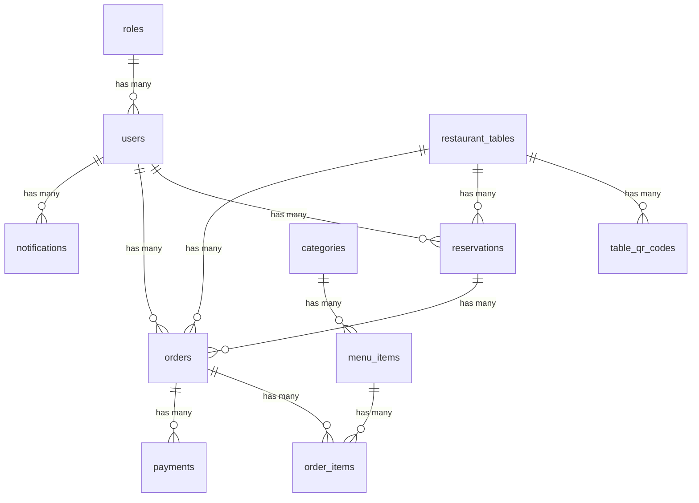

# Phase 2 – SQLAlchemy Models — Hoàn thành ✅

## A. Danh sách file đã tạo

| # | File | Model Class |
|---|------|-------------|
| 1 | [role.py](file:///d:/restaurant_management/backend/app/models/role.py) | `Role` |
| 2 | [user.py](file:///d:/restaurant_management/backend/app/models/user.py) | `User` |
| 3 | [table.py](file:///d:/restaurant_management/backend/app/models/table.py) | `RestaurantTable` |
| 4 | [qr_code.py](file:///d:/restaurant_management/backend/app/models/qr_code.py) | `TableQRCode` |
| 5 | [category.py](file:///d:/restaurant_management/backend/app/models/category.py) | `Category` |
| 6 | [menu_item.py](file:///d:/restaurant_management/backend/app/models/menu_item.py) | `MenuItem` |
| 7 | [reservation.py](file:///d:/restaurant_management/backend/app/models/reservation.py) | `Reservation` |
| 8 | [order.py](file:///d:/restaurant_management/backend/app/models/order.py) | `Order` |
| 9 | [order_item.py](file:///d:/restaurant_management/backend/app/models/order_item.py) | `OrderItem` |
| 10 | [payment.py](file:///d:/restaurant_management/backend/app/models/payment.py) | `Payment` |
| 11 | [notification.py](file:///d:/restaurant_management/backend/app/models/notification.py) | `Notification` |
| 12 | [__init__.py](file:///d:/restaurant_management/backend/app/models/__init__.py) | (imports all models) |

## B. File Phase 1 đã thay đổi

| File | Thay đổi |
|------|----------|
| [main.py](file:///d:/restaurant_management/backend/app/main.py) | Thêm import models + 3 health check endpoints mới |

Các file Phase 1 **không thay đổi**:
- `app/core/config.py` — No changes
- `app/core/database.py` — No changes
- `.env` — No changes
- `requirements.txt` — No changes

## C. Cấu trúc project sau Phase 2

```text
backend/
├── app/
│   ├── __init__.py
│   ├── main.py                ← updated
│   │
│   ├── core/
│   │   ├── __init__.py
│   │   ├── config.py
│   │   └── database.py
│   │
│   └── models/                ← NEW
│       ├── __init__.py
│       ├── role.py
│       ├── user.py
│       ├── table.py
│       ├── qr_code.py
│       ├── category.py
│       ├── menu_item.py
│       ├── reservation.py
│       ├── order.py
│       ├── order_item.py
│       ├── payment.py
│       └── notification.py
│
├── .env
├── .gitignore
└── requirements.txt
```

## D. Lệnh chạy project

```bash
cd backend
venv\Scripts\activate
uvicorn app.main:app --reload
```

## E. Test Results — Tất cả PASS ✅

### `GET /` — Root
```json
{"message": "Restaurant Management API is running"}
```

### `GET /health/db` — Database connection
```json
{"status": "ok", "database": "connected", "database_name": "restaurant_management"}
```

### `GET /health/models` — Models loaded (11 models)
```json
{
  "status": "ok",
  "models_loaded": 11,
  "models": ["categories", "menu_items", "notifications", "order_items", "orders",
             "payments", "reservations", "restaurant_tables", "roles", "table_qr_codes", "users"]
}
```

### `GET /health/tables` — Database tables exist
```json
{
  "status": "ok",
  "tables": ["categories", "menu_items", "notifications", "order_items", "orders",
             "payments", "reservations", "restaurant_tables", "roles", "table_qr_codes", "users"]
}
```

### `GET /health/orm` — ORM query works
```json
{"status": "ok", "roles_count": 3, "tables_count": 5}
```

## F. Relationship Map



## G. Key Design Decisions

| Quyết định | Lý do |
|------------|-------|
| `Numeric(12, 2)` cho money fields | Tránh sai số tiền tệ khi dùng Float |
| `Enum(...)` inline trong Column | Khớp chính xác với database schema |
| `user_id` nullable trong Reservation | Khách có thể đặt bàn không cần tài khoản |
| `unit_price` riêng trong OrderItem | Lưu giá tại thời điểm đặt hàng, không lấy giá hiện tại |
| `ondelete="CASCADE"` cho OrderItem.order_id | Xóa order sẽ xóa luôn order items |
| Không có `Base.metadata.create_all()` | Database đã tồn tại, models chỉ mapping |

## H. Common Errors & Solutions

| Lỗi | Nguyên nhân | Cách sửa |
|-----|-------------|----------|
| `ModuleNotFoundError: No module named 'app'` | Chạy uvicorn từ sai thư mục | Chạy từ `backend/` folder |
| `NoReferencedTableError` | Model chưa được import | Kiểm tra `app/models/__init__.py` có import đầy đủ |
| `InvalidRequestError: relationship ... back_populates` | Tên back_populates sai | Đảm bảo hai chiều khớp nhau |
| `OperationalError: Can't connect to MySQL` | MySQL chưa chạy hoặc sai password | Kiểm tra `.env` và MySQL service |
| `Enum error` | Giá trị Enum trong model không khớp DB | So sánh với `SHOW COLUMNS FROM table_name` |
| `Table already exists` | Đang dùng `create_all()` | **Không** dùng `Base.metadata.create_all()` — chỉ mapping |

## I. Swagger UI

Truy cập: http://127.0.0.1:8000/docs

Tất cả 5 endpoints hiển thị:
- `GET /`
- `GET /health/db`
- `GET /health/models`
- `GET /health/tables`
- `GET /health/orm`
